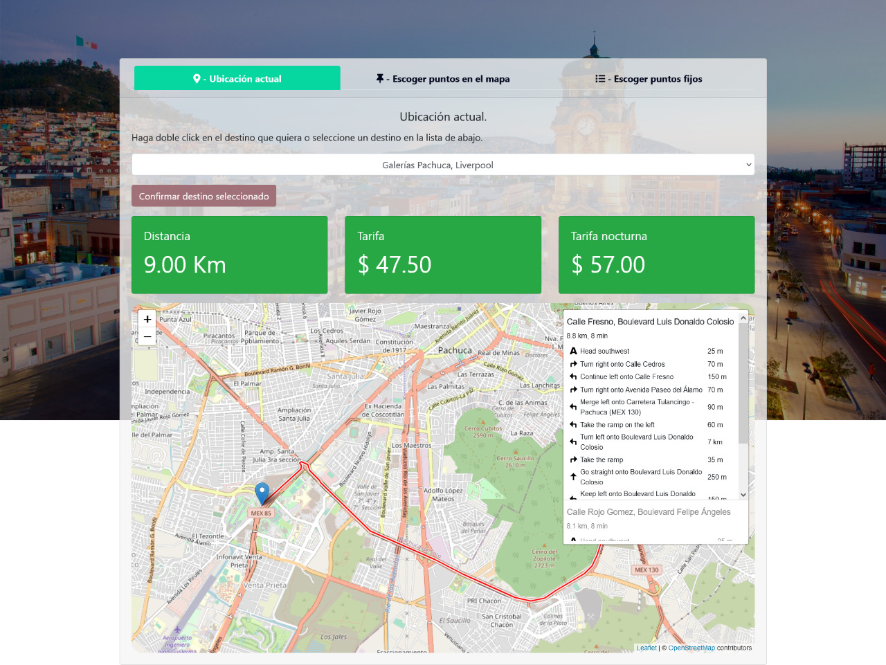

# Proyecto tarifas de rutas

## Acerca de este proyecto

- Usa la librería de <b>Leaflet</b> para la creación del mapa y las rutas
- Las rutas pueden ser determinadas mediante 3 opciones
  - Determinar la ubicación actual y escoger algún destino de una lista
  - Escoger entre 2 puntos de una lista 
  - Escoger 2 puntos en el mapa mediante un click
- Se determina la ruta, la distancia y en base a esta el costo de la tarifa

---

Live: https://luisdgza.github.io/proyectoTarifasRutas/

### Built with

- HTML
- JS
  - Leaflet
- CSS
  - Bootstrap 4
